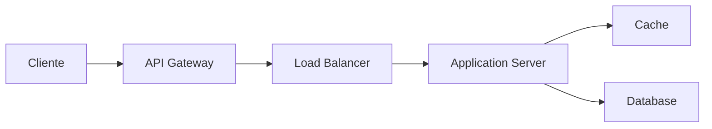
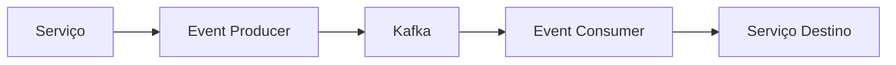

# 🏗️ Arquitetura do Sistema

## 📋 Visão Geral

O Mestre dos Jogos é uma plataforma de aluguel de jogos de tabuleiro construída com uma arquitetura moderna e escalável, seguindo os princípios de Clean Architecture e Domain-Driven Design (DDD).

## 🔧 Stack Tecnológica

### Frontend
- **Framework**: Angular 18 (standalone)
- **UI/UX**: Angular Material + Tailwind CSS
- **Gerenciamento de Estado**: NgRx
- **Formulários**: Reactive Forms
- **Requisições**: HttpClient
- **Autenticação**: Firebase Authentication
- **Testes**: Jasmine + Karma
- **Build Tool**: Angular CLI

### Backend
- **Framework**: Spring Boot 3.2
- **Linguagem**: Java 21
- **Banco de Dados**: Firebase Realtime Database
- **Storage**: Firebase Cloud Storage
- **Autenticação**: Firebase Admin SDK
- **Documentação**: SpringDoc OpenAPI (Swagger)
- **Testes**: JUnit + Mockito

### Infraestrutura
- **Cloud**: Firebase
  - Authentication
  - Realtime Database
  - Cloud Storage
  - Cloud Messaging
- **CI/CD**: GitHub Actions
- **Monitoramento**: Firebase Analytics
- **Logs**: Firebase Crashlytics

## 🏛️ Arquitetura

### Camadas da Aplicação

```
src/
├── application/       # Casos de uso e lógica de aplicação
├── domain/           # Entidades, regras de negócio e interfaces
├── infrastructure/   # Implementações concretas, adaptadores e serviços externos
└── presentation/     # Controllers, middlewares e rotas
```

### Princípios Arquiteturais

1. **Separação de Responsabilidades**
   - Cada módulo tem uma responsabilidade única e bem definida
   - Baixo acoplamento entre camadas
   - Alta coesão dentro dos módulos

2. **Inversão de Dependência**
   - Dependências apontam para dentro (em direção ao domínio)
   - Interfaces definem contratos entre camadas
   - Injeção de dependência para flexibilidade

3. **Clean Architecture**
   - Domínio no centro da arquitetura
   - Regras de negócio independentes de frameworks
   - Facilidade para testes e manutenção

## 🔄 Fluxo de Dados

1. **Request Flow**


2. **Event Flow**


## 🔐 Segurança

1. **Autenticação**
   - JWT para tokens de acesso
   - Refresh tokens com rotação
   - OAuth 2.0 para provedores externos

2. **Autorização**
   - RBAC (Role-Based Access Control)
   - Políticas de acesso granulares
   - Middleware de autorização

3. **Proteção de Dados**
   - Criptografia em trânsito (TLS)
   - Criptografia em repouso
   - Sanitização de inputs
   - Rate limiting
   - CORS configurado

## 📈 Escalabilidade

1. **Horizontal**
   - Containers stateless
   - Load balancing
   - Auto-scaling baseado em métricas

2. **Cache**
   - Cache em múltiplas camadas
   - Cache distribuído com Redis
   - Cache de consultas frequentes

3. **Database**
   - Replicação master-slave
   - Sharding quando necessário
   - Índices otimizados

## 🔍 Monitoramento

1. **Métricas**
   - Latência de requisições
   - Taxa de erros
   - Uso de recursos
   - Métricas de negócio

2. **Logging**
   - Logs estruturados
   - Rastreamento distribuído
   - Agregação centralizada

3. **Alertas**
   - Thresholds configuráveis
   - Alertas por severidade
   - Notificações automatizadas

## 🚀 Deploy

1. **Ambientes**
   - Desenvolvimento
   - Staging
   - Produção

2. **CI/CD**
   - Testes automatizados
   - Build e deploy automatizados
   - Rollback automático
   - Blue-green deployments

3. **Infraestrutura como Código**
   - Terraform para provisionamento
   - Helm charts para Kubernetes
   - Configuração versionada

## 📝 Documentação

1. **API**
   - OpenAPI/Swagger
   - Postman collections
   - Exemplos de uso

2. **Código**
   - TSDoc/JSDoc
   - README por módulo
   - Guias de contribuição

3. **Arquitetura**
   - Diagramas C4
   - Documentação de decisões (ADRs)
   - Guias de desenvolvimento 