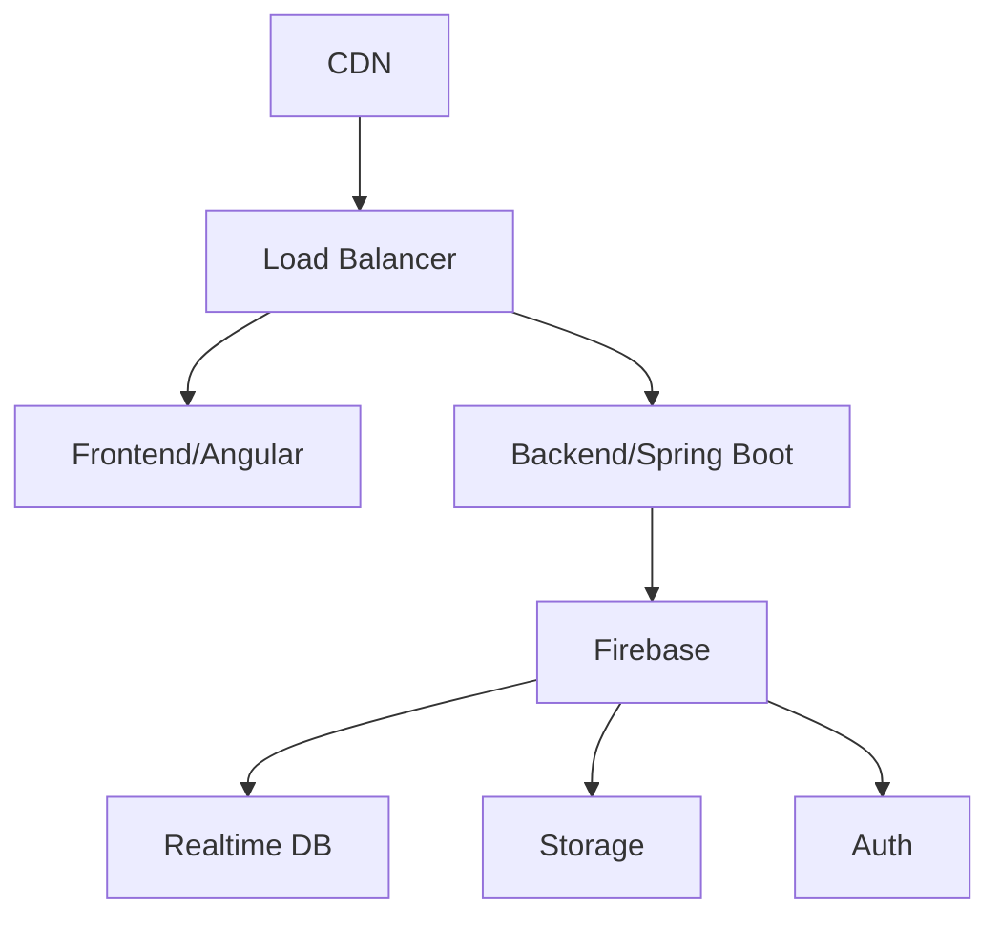

# 🚀 Deployment e DevOps

## 🔧 Stack de Deployment

### Frontend
- **Hosting**: Firebase Hosting
- **CI/CD**: GitHub Actions
- **Build**: Angular CLI
- **Testes**: Jasmine + Karma
- **Lint**: ESLint + Prettier

### Backend
- **Cloud**: Firebase Cloud Functions
- **CI/CD**: GitHub Actions
- **Build**: Maven
- **Testes**: JUnit + Mockito
- **Lint**: Checkstyle

### Banco de Dados
- **Database**: Firebase Realtime Database
- **Storage**: Firebase Cloud Storage
- **Backup**: Firebase Export/Import

### Monitoramento
- **Analytics**: Firebase Analytics
- **Crash Reports**: Firebase Crashlytics
- **Performance**: Firebase Performance Monitoring
- **Logs**: Firebase Cloud Logging

## Ambientes

### Desenvolvimento (dev)
- URL: `https://dev.mestredosjogos.com.br`
- Banco: Firebase Development Instance
- Branches: `develop`, `feature/*`

### Homologação (staging)
- URL: `https://staging.mestredosjogos.com.br`
- Banco: Firebase Staging Instance
- Branch: `release/*`

### Produção (prod)
- URL: `https://mestredosjogos.com.br`
- Banco: Firebase Production Instance
- Branch: `main`

## Pipeline CI/CD

### GitHub Actions Workflow

```yaml
name: CI/CD Pipeline

on:
  push:
    branches: [ main, develop, 'release/*' ]
  pull_request:
    branches: [ main, develop ]

jobs:
  test:
    runs-on: ubuntu-latest
    steps:
      - uses: actions/checkout@v3
      
      - name: Set up JDK
        uses: actions/setup-java@v3
        with:
          java-version: '21'
          
      - name: Run Tests
        run: ./mvnw test
        
  build:
    needs: test
    runs-on: ubuntu-latest
    steps:
      - name: Build Backend
        run: ./mvnw clean package -Pprod
        
      - name: Build Frontend
        run: |
          cd frontend
          npm install
          npm run build:prod
          
  deploy:
    needs: build
    runs-on: ubuntu-latest
    if: github.ref == 'refs/heads/main'
    steps:
      - name: Deploy to Production
        run: |
          # Deploy steps
```

## Configuração de Ambientes

### Backend

#### application-prod.yml
```yaml
spring:
  profiles:
    active: prod
    
firebase:
  config:
    path: ${FIREBASE_CREDENTIALS}
    
security:
  jwt:
    secret: ${JWT_SECRET}
    expiration: 86400000
    
cors:
  allowed-origins: https://mestredosjogos.com.br
```

### Frontend

#### environment.prod.ts
```typescript
export const environment = {
  production: true,
  apiUrl: 'https://api.mestredosjogos.com.br/v1',
  firebase: {
    apiKey: process.env.FIREBASE_API_KEY,
    // ... outras configs
  }
};
```

## Infraestrutura

### Diagrama de Infraestrutura


### Requisitos de Servidor
- 2 vCPUs
- 4GB RAM
- 20GB SSD
- Ubuntu 22.04 LTS

## Processo de Deploy

### 1. Preparação
```bash
# Backup do banco
firebase database:backup

# Verificar dependências
./mvnw dependency:analyze
npm audit
```

### 2. Build
```bash
# Backend
./mvnw clean package -Pprod

# Frontend
ng build --configuration=production
```

### 3. Deploy
```bash
# Backend
java -jar app.jar --spring.profiles.active=prod

# Frontend
firebase deploy --only hosting
```

### 4. Verificação
```bash
# Health check
curl https://api.mestredosjogos.com.br/actuator/health

# Logs
tail -f /var/log/mestredosjogos/application.log
```

## Monitoramento

### Métricas
- CPU Usage
- Memory Usage
- Response Time
- Error Rate
- Active Users

### Alertas
```yaml
alerts:
  - name: high_error_rate
    condition: error_rate > 5%
    notification: slack
    
  - name: high_latency
    condition: response_time > 2s
    notification: email
```

## Backup e Recuperação

### Backup Automático
```bash
#!/bin/bash
# backup.sh
DATE=$(date +%Y%m%d)
firebase database:backup ./backups/$DATE
```

### Recuperação
```bash
# Restore do banco
firebase database:restore backup_file.json

# Rollback de versão
git checkout v1.2.3
./deploy.sh
```

## Segurança

### Checklist de Produção
- [ ] Firewall configurado
- [ ] HTTPS forçado
- [ ] Secrets seguros
- [ ] Logs protegidos
- [ ] Backups criptografados

### Headers de Segurança
```nginx
add_header X-Frame-Options "SAMEORIGIN";
add_header X-XSS-Protection "1; mode=block";
add_header Content-Security-Policy "default-src 'self'";
```

## Troubleshooting

### Logs
- `/var/log/mestredosjogos/`
- Firebase Console Logs
- GitHub Actions Logs

### Comandos Úteis
```bash
# Verificar status
systemctl status mestredosjogos

# Verificar logs
journalctl -u mestredosjogos

# Verificar recursos
htop
```

## Rollback

### Procedimento
1. Identificar versão estável
2. Backup dos dados
3. Deploy da versão anterior
4. Verificar integridade
5. Atualizar DNS se necessário

### Comando de Rollback
```bash
./rollback.sh v1.2.3
```

## Documentação Adicional

### Links Úteis
- [Firebase Hosting](https://firebase.google.com/docs/hosting)
- [Spring Boot Deployment](https://docs.spring.io/spring-boot/docs/current/reference/html/deployment.html)
- [Angular Deployment](https://angular.io/guide/deployment)

### Contatos
- DevOps Team: devops@mestredosjogos.com.br
- Emergency: +55 11 99999-9999 